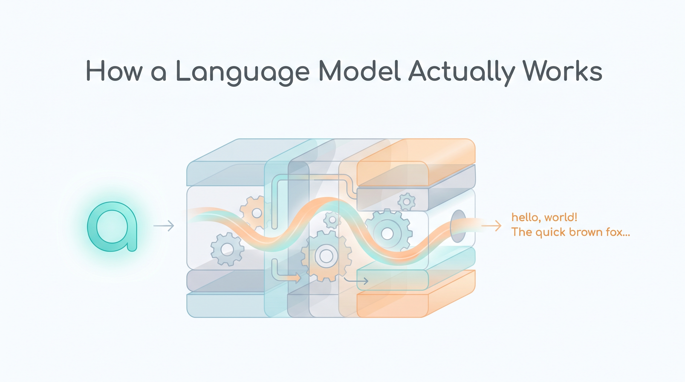
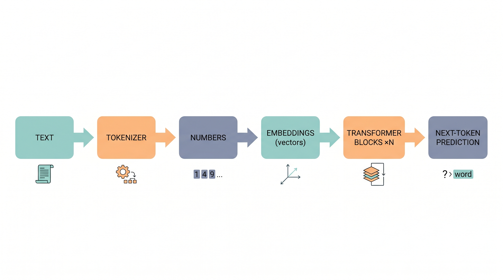
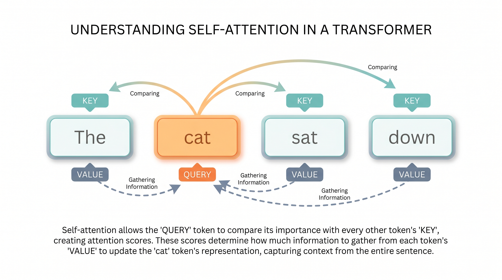
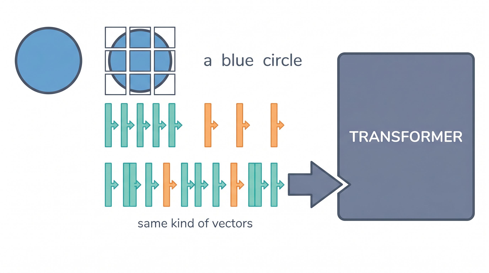

# How a Language Model Actually Works, in 3,000 Lines of Code You Can Read

*A small, fully-commented GPT you can train on a laptop in seven minutes. In this walkthrough, we'll follow a single character all the way through it, one layer at a time.*



---

Let me start with a confession that I think a lot of people quietly share.

For a long time, I could *talk* about how language models work. I knew the vocabulary, attention, embeddings, transformers, tokens, and I could point at the famous diagram with the stacked boxes. But if you had asked me to explain, step by step, what really happens to a single character as it travels through the model, I would have started strong and trailed off somewhere around "and then... attention happens."

That gap is normal, and it isn't your fault. The code most of us learn from hides the very thing we want to see. In a production library, attention is a single function call with a name like `scaled_dot_product_attention`, and all the arithmetic we came to understand is sealed inside it. You can use the model, but you can't *watch* it think.

So I wrote a small one whose only job is to be watchable. It's called **`myllm`**, and the idea is simple: a complete, modern GPT, written out plainly, with a comment on nearly every line, small enough that you can read the whole thing in an afternoon and train it on a MacBook in a few minutes. If you've seen Andrej Karpathy's nanoGPT, it's a cousin of that, built for understanding rather than speed.

In this article, we're going to do something specific together. We'll pick a single character and follow it all the way down through the model and back up again. By the end, you'll be able to tell that story yourself.

A quick note on tools before we begin: the code is written in **MLX**, Apple's array library, so it runs directly on the Mac's GPU with no special setup. No graphics-card drivers, no cloud account. If you have an Apple-Silicon Mac, you can run every command in this piece.

---

## First, the big picture

Before we zoom in, let's agree on what a language model even *is*, because the honest answer is smaller than you'd expect.

A language model is a function that takes a sequence of tokens and predicts the next one. That's the whole job. *Training* is the process of adjusting that function until its guesses start matching real text. *Generating* is just running the function forward again and again: predict a token, add it to the sequence, predict the next one, and so on.

Here is the entire journey our character will take. Don't worry about the details yet; just notice the shape of it:



```
text ──► tokenizer ──► token ids (integers)
                          │
                          ▼
              ┌───────────────────────────┐
              │ token embedding (B,T,C)    │  "what is each token?"
              └───────────────────────────┘
                          │   position is added later, inside attention, by RoPE
                          ▼
              ┌───────────────────────────┐
              │  N × Transformer Block     │
              │   x += attn(rmsnorm(x))    │  tokens share information
              │   x += ffn(rmsnorm(x))     │  each token thinks
              └───────────────────────────┘
                          │
                          ▼
                   final RMSNorm
                          │
                          ▼
              LM head ──► logits (B,T,vocab)   a score for every possible next token
                          │
            ┌─────────────┴──────────────┐
       training: compare to the     generating: pick a token,
       true next token              add it, and repeat
```

One small habit will make the rest of this much easier to read. Throughout the code, every piece of data is labeled with its *shape* in a comment: `(B, T, C)`. Those three letters stand for **B**atch (how many sequences we handle at once), **T**ime (how many tokens are in the sequence), and **C**hannels (how wide each token's vector is). Keep those three in mind and the code stops looking like math and starts looking like sentences.

Now let's walk the path, bottom to top.

---

## Step 1: The tokenizer turns text into numbers

A neural network can't read letters. It only works with numbers. So the very first thing we need is a translator that turns text into integers, and that translator is the **tokenizer**.

I chose the simplest tokenizer I could, on purpose: a **character-level** one. The vocabulary is nothing more than the list of unique characters in the training file. The letter `a` becomes one number, a newline becomes another, and so on. If you train on the works of Shakespeare, the entire vocabulary is about 65 characters. There's no hidden cleverness here, and that's exactly why it's a good place to start.

Of course, real text deserves something smarter, so the code also includes a second tokenizer built from scratch: a **byte-level BPE** tokenizer (`bpe.py`), the same family used by the big models. You can switch to it by changing one line of configuration:

```python
config.tokenizer    = "bpe"   # learn subwords instead of single characters
config.bpe_vocab_size = 4096
```

The advantage of subwords is that each one carries more text, so the model can "see" a longer passage at once. But the lesson is the same either way: the tokenizer is just a dictionary mapping pieces of text to numbers. Nothing more.

---

## Step 2: The embedding gives each number a meaning

Now we have a number. But a bare number like "39" tells the model nothing useful. So the next step looks that number up in a table and pulls out a **vector**, a list of `C` values that represents the meaning of that token.

Here's the part students often find surprising: that table of meanings is *learned*. It starts as random noise, and every step of training nudges it, until tokens that are used in similar ways drift close together on their own. Nobody hand-writes what "a" means. The model discovers it.

One thing is deliberately missing at this stage: any sense of *position*. The model knows *what* each token is, but not *where* it sits in the sentence. We'll fix that in the very next step, and the way we fix it is rather elegant.

---

## Step 3: Attention is where tokens talk to each other

This is the heart of the whole thing, so let's slow down and take it gently.

In the code, I wrote attention out the long way (the actual multiplications, the actual mask, the actual softmax) rather than calling a built-in shortcut. That's a choice. The shortcut is faster, but you can't see anything happen inside it, and seeing it happen is the entire reason this file exists.



The idea is this. Each token produces three vectors:

- a **Query**, which asks, *"what am I looking for?"*
- a **Key**, which advertises, *"here's what I have to offer,"*
- and a **Value**, *"here's what I'll contribute if you pick me."*

Every token's Query is compared against every token's Key. Strong matches get high scores; the scores are turned into weights that add up to one; and those weights are used to blend the Values together. In plain terms: each token looks around at the others, decides who's relevant, and gathers a little information from each.

There's one rule we have to enforce. Since the model's job is to predict the *next* token, we must never let a token peek at tokens that come after it. That would be cheating. So we apply a **causal mask** that blocks every token from looking into the future. A token at position five may look at positions one through five, and no further.

But attention, on its own, has a curious blind spot: **it doesn't know the order of the tokens.** If you shuffled the words in the sentence, the math would come out exactly the same. That can't be right, because order obviously matters in language. So we need a way to tell the model where each token sits.

The trick we use is called **RoPE** (Rotary Position Embeddings), and I want you to sit with how clever it is. Instead of adding a separate "position" signal, RoPE gently *rotates* each Query and Key by an angle that depends on its position:

```python
x1' = x1*cos - x2*sin
x2' = x2*cos + x1*sin
```

Why bother rotating? Because of what happens next. When two tokens' Queries and Keys are compared, the result ends up depending only on the *difference* between their positions. The model never has to memorize "this is token number five." Instead it naturally learns relationships like "this token is three steps behind me," and *that* is the kind of knowledge that transfers to brand-new sentences. Position, encoded as a relationship, almost for free.

The code includes a few optional refinements from recent research papers (grouped-query attention, query/key normalization, a "softmax that can attend to nothing"), each one switchable with a single flag, and each one turned *off* by default so your first read stays uncluttered. They're there for when you're ready, not before.

---

## Step 4: The feed-forward network is where each token thinks

Attention let the tokens share information with one another. The next sub-layer gives each token a moment to *process* what it just gathered, privately, on its own.

This is a small network applied to each token separately. Modern models use a particular flavor of it called **SwiGLU**, which works like this:

```
ffn(x) = down( silu(gate(x)) * up(x) )
```

You can read it as: expand the token into a larger space, use one part of that expansion as a "gate" that decides how much of the other part to let through, then shrink it back down. The gate is the interesting bit. It lets the network selectively emphasize some signals and quiet others. It's a modest improvement over the older, plain version, but a reliable one, which is why nearly every recent model adopted it.

---

## Step 5: Stack the blocks

We now have the two ingredients of a transformer block: attention (tokens share) and a feed-forward network (each token thinks). A block simply does both, one after the other:

```python
x = x + attn(rmsnorm(x))   # tokens share information
x = x + ffn(rmsnorm(x))    # each token thinks
```

Two details are worth naming. The `rmsnorm` is a normalization step that keeps the numbers in a healthy range so training stays stable; think of it as gently re-centering the data before each sub-layer. And the `x = x + ...` is a **residual connection**: instead of replacing the token's vector, each sub-layer *adds* its contribution. That little `+` is what lets us stack many blocks deeply without the signal getting lost on the way down.

So that's the recipe: take a block, repeat it `N` times, and you have the body of the model.

After the last block, one final normalization, and then the **LM head** turns each token's vector back into a score for every possible next token. A nice economy here: that head reuses the very same table from Step 2, the one that turned numbers into meanings, now run in reverse to turn meanings back into numbers. One table, two jobs.

---

## Step 6: Training is simpler than you'd think

We've built the model. How do we teach it? Honestly, this part is almost anticlimactic, and that's a good sign.

Take a random chunk of text. Ask the model to predict the next token at *every* position at once. Compare its predictions to the real next tokens and measure how wrong it was; that measurement is called the **loss**. Then adjust every weight a tiny bit in the direction that would have reduced the error. Repeat a few thousand times. On a laptop, that's about seven minutes.

The training file (`train.py`) wraps in the standard practical touches, like a learning-rate schedule that warms up and then cools down, and a few well-chosen optimizer settings, but the core loop is exactly the story above: *guess, measure, adjust, repeat.*

(One thing about MLX worth knowing: it's "lazy." When you write an operation, it doesn't run immediately. It's queued up, and the real computation happens only when you ask for a result. Once that clicks, the training loop reads naturally.)

---

## Step 7: Generating text

To actually produce writing, we run the model forward. Feed it a prompt, look at the scores it gives for the next token, choose one, add it to the sequence, and ask again. Repeat until you've written as much as you want.

You have some say in *how* it chooses. A "temperature" setting controls how adventurous versus predictable it is; other knobs trim away unlikely options. The code offers all of these, with sensible defaults.

There's also one important efficiency, called the **KV cache.** Without it, every new token would force the model to re-read the entire passage from the beginning, slower and slower as the text grows. The cache simply remembers the work already done for earlier tokens, so each new token only costs one small step. It's the difference between a model that responds instantly and one that crawls.

You can run the finished model three ways:

```bash
python sample.py --prompt "ROMEO:"   # generate once from a prompt
python sample.py -i                  # an interactive prompt you can chat with
python serve.py                      # a small web server, so other programs can call it
```

That web server, by the way, is about 200 lines of plain Python with no extra libraries, because part of the lesson is that an "inference server" isn't magic either.

---

## Step 8: Turning a writer into an assistant

A freshly trained model is a *continuer*, not a chatbot. Give it `"ROMEO:"` and it happily keeps writing in that style, but it won't answer a question, because it was never shown what answering looks like.

The fix is a second, shorter round of training (`sft.py`) on examples shaped like *(instruction, response)*. The clever part is **loss masking**: when we measure the error, we only grade the model on the *response*, never on the instruction it was given. We're teaching it to *reply*, not to repeat the question back. That one idea is the quiet foundation under every instruction-following model you've used, and here it's just a handful of readable lines.

---

## A surprise to end on: the same model can see

I saved my favorite part for last, because it casts everything we've done in a new light.

Look back at Step 2. A transformer never really worked with *text*. It worked with *vectors*. The only thing that turned text into vectors was that one embedding table. Which raises a wonderful question: what if we built a *second* converter, one that turns an **image** into the same kind of vectors, and slipped those in front of the text?



The answer is that attention treats them all the same, and you've built a model that can describe a picture. No new architecture. The model genuinely does not care whether a vector came from a letter or from a patch of an image.

That's exactly what the vision demo does. It cuts an image into small patches, turns each patch into one vector (the image's version of the embedding table), and feeds them into the *unchanged* model:

```bash
python vision.py        # see the toy dataset: colored shapes, drawn in your terminal
python train_mm.py      # train an image → caption model from scratch (~2 min)
python sample_mm.py --n 8   # have it describe eight brand-new images
```

I kept a strict rule while building it: no image-specific code was allowed to creep into the model itself. The model stays beautifully ignorant of where its vectors come from, and that single idea, I'd argue, is the most useful intuition you can carry away about how the large multimodal models "see." It isn't a separate eye bolted onto a brain. It's the same brain, handed a different kind of input.

---

## What makes this a *modern* model (and the papers behind each piece)

Here's something worth saying plainly, because it surprised me when I first understood it: the transformer in this code is not the 2017 "Attention Is All You Need" design, and it isn't even GPT-2 from 2019. Almost every component has quietly been replaced by something better over the last few years. The headline architecture barely changed; the *parts* changed a lot.

So before we close, let me give you a short field guide to what's actually in here and where each idea came from. If you only ever remember the names, you'll be able to read a modern model's code and recognize old friends.

**The pieces that are now standard:**

- **RoPE, rotary position embeddings** (*Su et al., "RoFormer," 2021*). The position trick from Step 3. It replaced the old "learned position table" of GPT-2, and it's what Llama, Mistral, and most current models use. The code precomputes the rotation angles once and applies them inside attention.

- **RMSNorm** (*Zhang and Sennrich, 2019*). The normalization in every block. It's a stripped-down LayerNorm that skips the mean-centering step, so it does less arithmetic for the same stabilizing effect. Standard in the Llama family.

- **SwiGLU feed-forward** (*Shazeer, "GLU Variants Improve Transformer," 2020*). The gated "thinking" layer from Step 4. Because it uses three weight matrices instead of two, the code shrinks the hidden width to about 8/3 of the model width (Llama's exact trick) so the parameter count stays fair.

- **Weight-tied output head** (*Press and Wolf, 2017*). The economy from Step 5, where the embedding table is reused, in reverse, as the final layer. One matrix, two jobs, fewer parameters to train.

- **KV cache.** The inference speed-up from Step 7. Not a paper so much as a universal engineering practice, but it's the difference between a usable model and an unusably slow one.

**The optional upgrades, each one flag-gated and off by default** (they're in the code so you can switch them on and *watch* what changes):

- **GQA, grouped-query attention** (*Ainslie et al., 2023*). Let several Query heads share a single Key/Value head, which shrinks the memory the KV cache needs. Llama-2-70B, Mistral, and Qwen all use it. In the config it's one number: set `n_kv_head` below `n_head`.

- **Mixture of Experts** (*Shazeer et al., 2017; popularized again by Mixtral, 2024*). Replace the single feed-forward with several "expert" networks and a small router that sends each token to just a couple of them. You get the capacity of many experts but pay for only a few per token. The code even includes the **load-balancing auxiliary loss** that keeps the router from lazily favoring one expert.

- **QK-Norm** (*query/key normalization, used across many 2024–25 models*). Normalize the Query and Key vectors before scoring them. This bounds how large the attention scores can get, which stops training from blowing up and lets you push the learning rate higher. A cheap stability win.

- **Softmax-off-by-one**, also called "quiet attention" (*Evan Miller, "Attention Is Off By One," 2023*). A one-character change to the softmax that lets a token attend to *nothing* when nothing is relevant, instead of being forced to spread its attention somewhere. The payoff is subtle but real: it drains the giant "outlier" activations that otherwise appear in a few channels, which makes the model far easier to **quantize** later, and it's closely related to the "attention sink" phenomenon (*Xiao et al., StreamingLLM, 2023*).

**Two more, on the practical side:**

- **Entropy-based ("entropix") sampling.** Instead of a fixed temperature, this measures the model's *own* uncertainty at each step, its entropy and "varentropy", and adapts: when the model is confident, it cools toward picking the single best token; when the model is genuinely torn, it heats up and explores. It makes the model's uncertainty visible in the text it produces. (This one comes from the open-source `entropix` project rather than a formal paper.)

- **Scaling knobs that let a bigger model fit on the same laptop.** Three switches, each a real production technique kept readable: **bfloat16** weights (half the memory, so you can train a model twice as big), **gradient checkpointing** (recompute activations during backprop instead of storing them, trading ~30% more compute for a large memory saving), and **n-bit quantization** at inference (store the weights in 4 or 8 bits, roughly 6× smaller, still coherent). The training data is also **memory-mapped** from disk, so the corpus can be larger than your RAM.

You don't need any of these to understand the core idea, which is exactly why they're all optional. But together they're a fair snapshot of what separates a 2024-era transformer from the original. Flip them on one at a time and you can feel what each one buys you.

---

## Why bother with something so small?

Because small is the only size you can actually hold in your head, and the enormous models are, underneath, this exact machine. The same embedding, the same attention, the same blocks. Just wider, deeper, and trained on far more text. The handful of settings in `config.py` (how many layers, how wide, how long a context) are the entire story of scaling, shrunk down to where you can see and feel each trade-off.

So here is my invitation. If you've ever wanted to stop reciting the words and actually *watch* a character become a number, become a meaning, become a prediction, and finally a lesson the model learns from, clone the code, open the model file, and read it from top to bottom. The comments will walk beside you the rest of the way.

```bash
git clone <your-repo-url> && cd myllm
./setup.sh && source .venv/bin/activate
python data.py && python train.py
python sample.py -i
```

About seven minutes from now, you'll have trained a language model you can explain, line by line, to someone else.

And being able to explain it to someone else: that's what it means to actually understand it.

---

*`myllm` runs on Apple-Silicon Macs via MLX. A fuller reference (the underlying math, every module, and the complete list of settings) lives in `docs/ARCHITECTURE.md`, with an accompanying slide deck in `docs/presentation.html`.*
